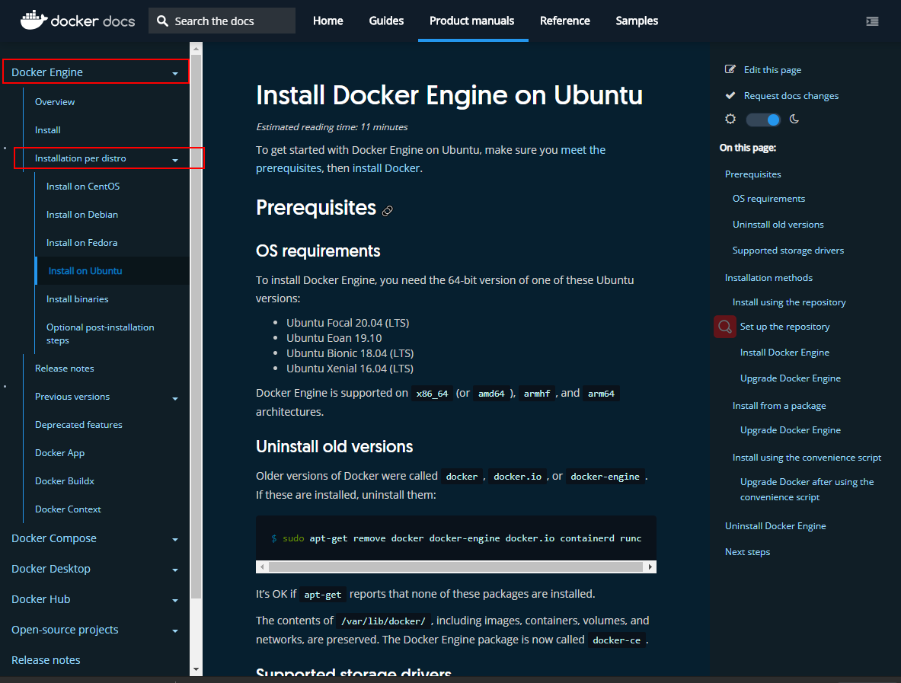
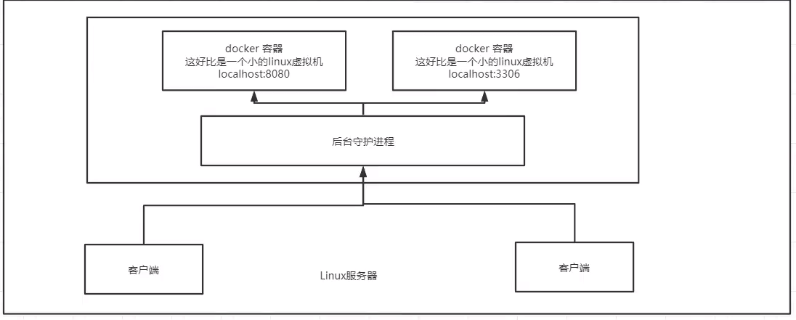

[TOC]


# Docker 概述  

## Dockers为什么会出现?

问题:在我的电脑上可以运行! 软件的版本更新,导致服务不可用!对于运维来说,考验十分的大?

环境配置是十分的麻烦,每一个机器都要部署环境,费时费力。

 传统：开发jar，运维来做！

 现在：开发打包部署上线，一套流程做完！

 Java –- apk – 发布（应用商店） ---- 张三使用apk -- 安装即可用！

 Java – jar（环境） ----打包项目带上环境（镜像） ----（Docker仓库：商店）

下载我们的镜像----直接的运行。

Docker 给以上问题提出了解决方案！  

  Dockers的思想就是来自于集装箱！


  JRE -- 多个应用（端口冲突） --- 原来都是交叉的！

  隔离：Dockers核心西乡！打包装箱！每个箱子相互隔离的。

  一个集箱装箱装水果， 一个装生化武器，不会有用问，因为他们之间被集装箱隔离了。
 Dockers通过隔离机制，可以将服务器利用到极致。

 本质：所有的技术都是因为出现了一些问题，我们需要去解决，才去学习。

## Dockers 的历史

  2010年，几个搞IT的年轻人，就在美国成立一家公司“dotcloud”做一些pass的云计算服务。 LXC有关的容器技术。

  他们将自己的容器化技术命名就是Dockers！

  Docker 刚刚诞生的时候没有引起行业的注意！dotcloud就活不下去！他们决定开源。

  2013年，创始人将Dockers开源！越来越多人发现了docker的优点。火了。之后Dockers每个月都会更新个版本。

  2014年4月9日，Docker1.0发布！

Docker 为什么这么火？ 因为相当于虚拟机十分的轻巧。在容器技术出来之前，我们都是使用虚拟机技术！

虚拟机：在windows中装一个VMware，通过这个软件我们可以虚拟出来一台或者堕胎电脑！但是很笨重。

虚拟机也是须臾虚拟化技术，Dockers容器技术，也是一种虚拟化技术。

```c
 Vm： linux centos 原生镜像（一个电脑！） 隔离，需要开启多个虚拟机
 Dockers： 隔离，镜像（最核心的环境 4MB + jdk + mysql）十分的轻巧，运行镜像就可以了。    
```


## 聊聊Docker

  Docker是基于go语言开发的

 

  Docker文档https://docs.docker.com/

  Docker 的文档是超级详细的！

## Docker能干吗

**虚拟机技术缺点：**

​     1、  资源占用多

​     2、  冗余步骤多

​     3、  启动很慢

**容器化技术：**

   容器化技术不是模拟的一个完整的操作系统

 

  比较Dockers和虚拟机技术的不同：

  ·传统虚拟机，虚拟出一条硬件，运行一个完整的操作系统，然后在这个系统上安装和运行软件

  ·容器内的应用直接运行在宿主机的内容，容器没有自己的内核，也没有虚拟我们的硬件。

  ·每个容器间是互相隔离的，每个容器间互不影响。

  

DevOps（开发、运维）

  应用更快速的交付和部署

  传统：一堆帮助文档，安装程序

  Docker：一键运行发布测试，一键运行

  更便捷的升级和扩容

  使用了Dockers只有，我们部署应用就和搭积木一样！

  更简单的系统运维

  在容器化之后，我们开发，测试化境都是高度一致的。

  更高效的集算资源利用：

  Docker是内核级别的虚拟化，可以在一个物理机上可以运行很多的容器实例，服务器的性能可以被压榨到极致。


# Docker安裝


**镜像(image):**

docker镜像就好比是一个模板,可以通过这个模板来创建容器服务;tomcat镜像--->run--->tomcat01容器(提供服务器)。

**容器(container):**

Dockers利用容器技术，独立运行一个或者一组应用，通过镜像来创建。

启动，停止，删除，基本命令。

目前就可以把这个容器理解为就是一个简易的Linux系统。

**仓库(repostory):**

仓库就是存放镜像的地方。

仓库分为共有长裤和私有仓库。

仓库Docker Hub默认是国外的， 可以用阿里云来加速。

# 安装Dock

## 环境准备

1、需要会一点点Linux的基础

2、Ubuntu18.04安装

​	进入官网，拉到最底端，点击docs，看帮助文档的download and install,选择合适自己的版本。



https://docs.docker.com/engine/install/ubuntu/

### 1、Uninstall old versions

Older versions of Docker were called `docker`, `docker.io`, or `docker-engine`. If these are installed, uninstall them:

```
$ sudo apt-get remove docker docker-engine docker.io containerd runc
```

#### 2、SET UP THE REPOSITORY

1. Update the `apt` package index and install packages to allow `apt` to use a repository over HTTPS:

   ```
   $ sudo apt-get update
   
   $ sudo apt-get install \
       apt-transport-https \
       ca-certificates \
       curl \
       gnupg-agent \
       software-properties-common
   ```

2.Add Docker’s official GPG key:

```
  $ curl -fsSL https://download.docker.com/linux/ubuntu/gpg | sudo apt-key add -
```

 Verify that you now have the key with the fingerprint `9DC8 5822 9FC7 DD38 854A E2D8 8D81 803C 0EBF CD88`, by searching for the last 8 characters of the fingerprint.

```c
$ sudo apt-key fingerprint 0EBFCD88

pub   rsa4096 2017-02-22 [SCEA]
      9DC8 5822 9FC7 DD38 854A  E2D8 8D81 803C 0EBF CD88
uid           [ unknown] Docker Release (CE deb) <docker@docker.com>
sub   rsa4096 2017-02-22 [S]
```

3.Use the following command to set up the **stable** repository. To add the **nightly** or **test** repository, add the word `nightly` or `test` (or both) after the word `stable` in the commands below. [Learn about **nightly** and **test** channels](https://docs.docker.com/engine/install/).

```

$ sudo add-apt-repository \
   "deb [arch=amd64] https://download.docker.com/linux/ubuntu \
   $(lsb_release -cs) \
   stable"
```

## 安装

1.Update the `apt` package index, and install the *latest version* of Docker Engine and containerd, or go to the next step to install a specific version:

```
 $ sudo apt-get update
 $ sudo apt-get install docker-ce docker-ce-cli containerd.io
```

Verify that Docker Engine is installed correctly by running the `hello-world` image.

```shell
$ sudo docker run hello-world
```

Terminal display after running 


Query version 

```
$ sudo docker version
```


## dockers运行流程图


## 底层原理

**Dockers是怎么工作的？**

​	Dockers是一个Client-Server结构的系统，Docker的守护进程运行在主机上，通过Socket从客户端访问！

​	DockerServer接收到Docker-Clien他的指令，就会执行这个命令！



**Docker为什么比VM虚拟机快**

1、Docker有着比虚拟机更少的抽象层

2、Docker利用的是宿主机的内核，VM需要是所需要虚拟操作系统的内核


​	所以所，新建一个容器的时候，Docker不需要虚拟机一样重新加载一个系统内核，避免了引导。


# Docker的常用命令

## **帮助命令**

```makefile
	docker version   		#显示dockers的版本信息
	docker info  			#显示docker的系统信息，包括镜像和容器的数量
	docker  --help 			#帮助命令
```

帮助文档地址：

​	https://docs.docker.com/engine/reference/run/


## 镜像命令

**docker images 查看所有本地的主机上的镜像**

```sh
jay@ubuntu:~ $ sudo docker images
[sudo] password for jay: 
REPOSITORY          TAG                 IMAGE ID            CREATED             SIZE
hello-world         latest              bf756fb1ae65        7 months ago        13.3kB

#解释
REPOSITORY 	镜像仓库源
TAG			镜像的标签
IMAGE ID	镜像的ID
CREATED		创建时间
SIZE		大小

#可选项
Options:
  -a, --all             Show all images (default hides intermediate images)

  -q, --quiet           Only show numeric IDs   #只显示镜像ID

```

**doecker search 搜索镜像**

```shell
jay@ubuntu:~ $ sudo docker search mysql
NAME                              DESCRIPTION                                     STARS               OFFICIAL            AUTOMATED
mysql                             MySQL is a widely used, open-source relation…   9788                [OK]                
mariadb                           MariaDB is a community-developed fork of MyS…   3571                [OK]                
mysql/mysql-server                Optimized MySQL Server Docker images. Create…   717                                     [OK]

#可选项，通过收藏来过滤
 --filter=STARTS=3000		#搜索出来的镜像就是sTARTS大于3000的

 jay@ubuntu:~ $ sudo docker search mysql --filter=STARS=3000
NAME                DESCRIPTION                                     STARS               OFFICIAL            AUTOMATED
mysql               MySQL is a widely used, open-source relation…   9788                [OK]                
mariadb             MariaDB is a community-developed fork of MyS…   3571                [OK]                
jay@ubuntu:~ $ 

```

**docker pull  下载镜像**

```shell
#下载镜像docker pull 镜像名[:tag]

buntu:~ $ sudo docker pull mysql
Using default tag: latest 	#如果不屑tag，默认就是latest
6ec8c9369e08: Pull complete 	#分层下载，这是docker image的核心，联合文件系统
177e5de89054: Pull complete 
ab6ccb86eb40: Pull complete 
e1ee78841235: Pull complete 
09cd86ccee56: Pull complete 
78bea0594a44: Pull complete 
caf5f529ae89: Pull complete 
cf0fc09f046d: Pull complete 
4ccd5b05a8f6: Pull complete 
76d29d8de5d4: Pull complete 
8077a91f5d16: Pull complete 
922753e827ec: Pull complete 
Digest: sha256:fb6a6a26111ba75f9e8487db639bc5721d4431beba4cd668a4e922b8f8b14acc
Status: Downloaded newer image for mysql:latest
docker.io/library/mysql:latest  #真实地址

#一下两个命令相等
buntu:~ $ sudo docker pull mysql
buntu:~ $ sudo docker pull docker.io/library/mysql:latest

#指定版本下载
jay@ubuntu:~ $ sudo docker pull mysql:5.7
5.7: Pulling from library/mysql
6ec8c9369e08: Already exists  #分层下载的精髓所在，最新版本里有的可以不用下载
177e5de89054: Already exists 
ab6ccb86eb40: Already exists 
e1ee78841235: Already exists 
09cd86ccee56: Already exists 
78bea0594a44: Already exists 
caf5f529ae89: Already exists 
4e54a8bcf566: Pull complete 
50c21ba6527b: Pull complete 
68e74bb27b39: Pull complete 
5f13eadfe747: Pull complete 
Digest: sha256:97869b42772dac5b767f4e4692434fbd5e6b86bcb8695d4feafb52b59fe9ae24
Status: Downloaded newer image for mysql:5.7
docker.io/library/mysql:5.7

```

## **docker rmi 删除镜像**

```shell
jay@ubuntu:~ $ sudo docker rmi 8679ced16d20
Untagged: mysql:5.7
Untagged: mysql@sha256:97869b42772dac5b767f4e4692434fbd5e6b86bcb8695d4feafb52b59fe9ae24
Deleted: sha256:8679ced16d206961b35686895b06cfafefde87ef02b518dfc2133081ebf47cda
Deleted: sha256:355f87dc5125a32cc35898a4dde17fb067585bc0d86704b5a467c0ccc0eea484
Deleted: sha256:8299d5c38042216210125535adb2600e46268a0e2b9ec799d12ea5b770236e79
Deleted: sha256:07311a303b2c7cf2ac6992aaf68e12326fe7255985166939cbab7d18b10e0f47
Deleted: sha256:306c9bc1ce2997d000bb6f1ea4108420d9752df93ce39164b7a2f876b954afc4
jay@ubuntu:~ $ sudo docker images
REPOSITORY          TAG                 IMAGE ID            CREATED             SIZE
mysql               latest              e3fcc9e1cc04        9 days ago          544MB
hello-world         latest              bf756fb1ae65        7 months ago        13.3kB
```

## 容器命令

​	说明：我们有的镜像才可以创建容器，linux，下载一个centos来学习

​	docker pull centos

  